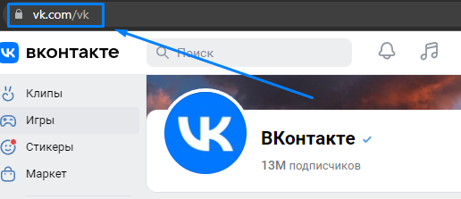
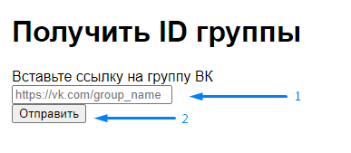
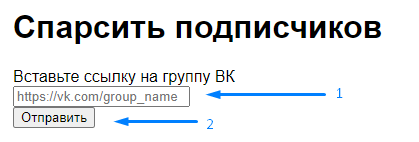
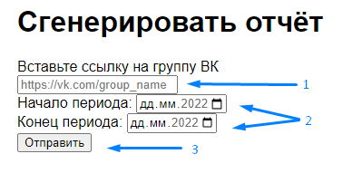

# Запуск

Приложение запускается через файл `run.py` \
Полный адрес: `smm_parser/app/run.py` \
Сайт будет располагаться по веб-адресу: http://127.0.0.1:5001

# Тестирование функций
## Получение ID
1. Скопируйте ссылку на группу ВКонтакте, id которой вам нужно

1. Вставьте ссылку в текстовое окно
1. Нажмите кнопку «Отправить»

1. Если происходит ошибка, проверьте правильность написания ссылки.
Ссылка должна иметь вид: **https://vk.com/group_name**
## Парсинг подписчиков
1. Скопируйте ссылку на группу ВКонтакте, участники которой вам нужны

1. Вставьте ссылку в текстовое окно
1. Нажмите кнопку «Отправить»

2. Если происходит ошибка, проверьте правильность написания ссылки. Ссылка должна иметь вид: **https://vk.com/group_name**
## Генератор отчётов
1. Скопируйте ссылку на группу ВКонтакте, отчёт по которой вам нужен

1. Вставьте ссылку в текстовое окно
Выставьте дату начала периода отчётности и конца периода отчётности. Дата начала отчётности не должна быть раньше конца отчётности

1. Нажмите кнопку «Отправить»
1. Отчёт будет находится в папке приложения по пути: _smm_parser\app\output_
## Распространённые проблемы и ошибки
* SMM-парсер собирает только открытые данные. Если сообщество закрыто или ограничен доступ к подписчикам сообщества, то функция может выдать ошибку или сгенерировать пустой отчёт.
* Неправильно указанная ссылка. Ссылка должна иметь вид: **https://vk.com/group_name**
*  Указана ссылка на аккаунт пользователя. SMM-парсер умеет работать только с группами. 
*  Если в группе нет постов за указанный период, то программа может выдать ошибку или сгенерировать пустой отчёт.
